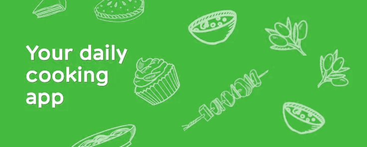

## Vue Recipe app

## Table of Contents

- [Introduction](#introduction)
- [Features](#features)
- [Build Process](#build-process)
- [Tech Stack](#tech-stack)

 

## Introduction

A simple recipe app build for learning vue js.

## Features

🚀 Add Recipe Menus  
🚀 Read/Edit Recipe Menus

## Build Process

- Clone or download the repo
- `npm install` or `yarn` to install dependencies
- `npm start` or `yarn run dev` to run the application

## Tech Stack

    
    

## Project Goals & Outcomes

✔️ Learning Vue js  
✔️ Learning Vue-X  
✔️ Learning Tailwind CSS